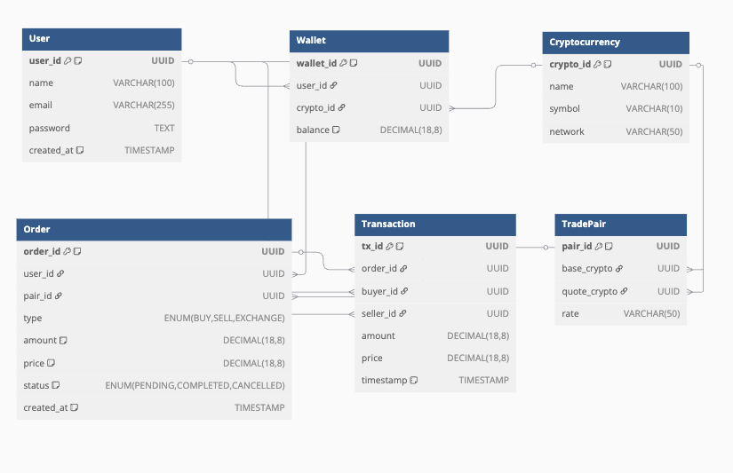

# Exhange API for Skuberg test

## Backend Schema

Database schema สำหรับฐานข้อมูล(รูปแบบ ER) ที่เป็นตัวกลางของการแลกเปลี่ยน Cryptocurrencies ระหว่าง User และ Backend มีรายละเอียดตามรูปด้านล่างนี้

โดยประกอบไปด้วย **six main entities** tables คือ

**User**, **Wallet**, **Cryptocurrency**, **TradePair**, **Order**, and **Transaction**.

- _User_ จัดเก็บข้อมูลของ user
- _Wallet_ จัดเก็บข้อมูลกระเป๋า มีความสัมพันธ์กับ _User_ และ _Cryptocurrency_ ที่จัดเก็บ (fk)
- _Cryptocurrency_ จัดเก็บข้อมูลทั่วไปของเหรียญ
- _TradePair_ จัดเก็บคู่ trade ในการแลกเปลี่ยนเหรียญ
- _Order_ จัดเก็บรายการคำสั่งซื้อขาย มีความสัมพันธ์กับ _User_ และ _TradePair_ ที่ใช้สำหรับแลกเปลี่ยนหรือซื้อขาย โดยมีสถานะ ('BUY', 'SELL', 'EXCHANGE')
- _Transaction_ จัดเก็บประวัติการซื้อขายและการแลกเปลี่ยนเหรียญ มีความสัมพันธ์กับ _Order_ ที่เกิดขึ้น และ _User_ ทำการซื้อขายแลกเปลี่ยนระหว่างกัน

# API spec

ฟังก์ชันของ api ที่ได้จัดทำ ครบอคลุม function คร่าวๆของระบบดังนี้

- ระบบสร้างบัญชีผู้ใช้ {Users}
- ระบบสามารถตั้ง ซื้อ-ขาย Cryptocurrencies {Order}
- ระบบบันทึกการโอนเงินและซื้อ-ขายแลกเปลี่ยน {Order,Transactions}

Creates a new user with the given details

### Users

_POST_ /users/login > Creates a new user

### Wallet

_POST_ /users/wallet > Creates a new wallet \
_GET_ /users/wallet > Get a wallet by wallet id \
_PUT_ /users/wallet/:id > Update a wallet

### Orders

_POST_ /orders > Create a new order \
_GET_ /orders/{id} > Get a transaction

# **ขั้นตอนการ run**

ตัว API deploy บน server เรียบร้อยแล้ว สามารถใช้งานได้ที่ [API Link](https://backend-test-skuberg-production.up.railway.app/api/v1/api-docs/#/) \
สามารถกดดู รายละเอียดจาก swagger doc และทำการ run ได้จาก example api ที่มีได้เลย

## Seed data

ตัว seed data random จาก pakage faker js อยู่แล้ว และเนื่องจาก deploy แล้ว จึงขอข้ามขั้นตอนนี้ครับ

### Additional

ฟังก์ชันเพิ่มเติมของระบบที่คิดว่าควรมี แต่ทำไม่ทัน จึงขออธิบายไว้

- feature token เพื่อ authenticate สิทธิ์การใช้งานฟังก์ชันต่างๆของผู้ใช้
- ระบบ verify ตัวตนจาก email หรือ sms เพื่อใช้ในการ verify user
- dynamics pricing ของ คู่เหรียญ และฟังชันก์ calculate exchange เนื่องจากผมคิดว่าต้องมีระบบนี้และมี logic ค่อนข้างซับซ้อน จึงขอข้ามครับ อาจจะเพิ่มได้ด้วยการใช้ third parties API ร่วมด้วย
- ระบบ migration database ผมยังไม่เคยทำกับ nodejs เคยทำแต่กับ go เลยจะยังไม่มี feature นี้ครับ

ขอบคุณครับ
